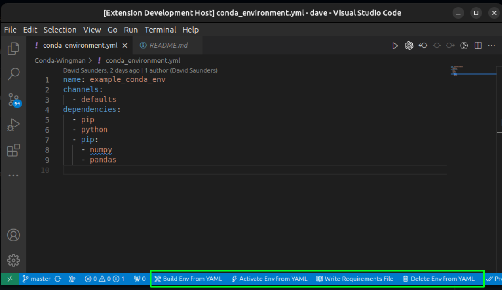
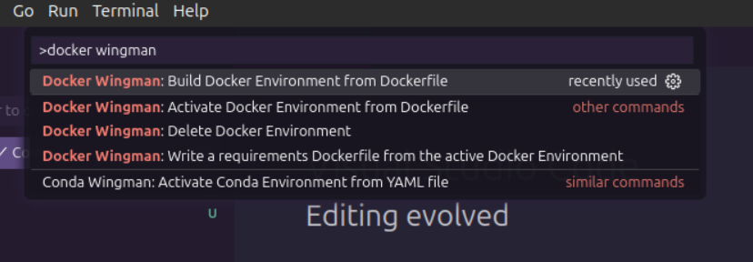

# Docker Wingman


[](https://github.com/DJSaunders1997/docker-wingman/blob/main/LICENSE)
[]()
[](https://github.com/DJSaunders1997/docker-wingman/actions/workflows/release.yml)


[](https://marketplace.visualstudio.com/items?itemName=djsaunders1997.docker-wingman)
[](https://marketplace.visualstudio.com/items?itemName=djsaunders1997.docker-wingman)
[](https://marketplace.visualstudio.com/items?itemName=djsaunders1997.docker-wingman)


This is the README for the extension [Docker Wingman](https://marketplace.visualstudio.com/items?itemName=DJSaunders1997.docker-wingman).

This extension aims to help VSCode users manage and interact with Docker environments.
Docker Wingman aims to add QoL improvements that help programmers use environments without having to memorise all of the docker commands.

## Features



Docker Wingman dynamically adds status bar items for quick Docker command access when a Dockerfile is open, simplifying Docker environment management directly within VSCode.

These can also be accessed from the VScode command pallet:


### Clickable Base Image Links
FROM image references in your Dockerfile are clickable and link directly to Docker Hub.

### Hover Tooltips
Hover over a FROM image reference to see Docker Hub info: description, stars, pull count, and last updated date.

The supported commands are:

### Creating Environments 
- **Command:** Create a Docker environment from the open requirements file by running:
  ```docker build -t imageName -f dockerfilepath .```
- **VS Code Command Palette:** `>Docker Wingman: Build Docker Environment from Dockerfile`

### Activating Environments
- **Command:** Activate an existing Docker environment with:
  ```docker run --name containername imagename```
- **VS Code Command Palette:** `>Docker Wingman: Activate Docker Environment`

### Stopping and Removing Containers
- **Command:** Stop and remove a Docker container:
  ```docker stop containername && docker rm containername```
- **VS Code Command Palette:** `>Docker Wingman: Stop and Remove Docker Container`

## Release Notes

See [CHANGELOG](CHANGELOG.md) for more information.


## Contributing

All contributions are welcome! 
Please feel free to fork the repository and create a pull request.

## License

Distributed under the MIT License. See [LICENSE](LICENSE) for more information.

## Author

David Saunders - 2024