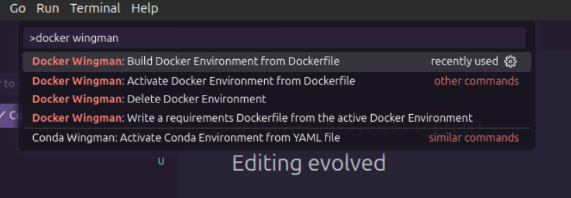

# Docker Wingman


[](https://github.com/DJSaunders1997/docker-wingman/blob/main/LICENSE)
[]()
[](https://github.com/DJSaunders1997/docker-wingman/actions/workflows/release.yml)


[](https://marketplace.visualstudio.com/items?itemName=djsaunders1997.docker-wingman)
[](https://marketplace.visualstudio.com/items?itemName=djsaunders1997.docker-wingman)
[](https://marketplace.visualstudio.com/items?itemName=djsaunders1997.docker-wingman)


This is the README for the extension [Docker Wingman](https://marketplace.visualstudio.com/items?itemName=DJSaunders1997.docker-wingman).

This extension aims to help VSCode users manage and interact with Docker environments.
Docker Wingman aims to add QoL improvements that help programmers use environments without having to memorise all of the docker commands.

## Features


Docker Wingman dynamically adds status bar items for quick Docker command access when a Dockerfile is open, simplifying Docker environment management directly within VSCode.

These can also be accessed from the VScode command pallet:


The supported commands are:

### Creating Environments 
- **Command:** Create a Docker environment from the open requirements file by running:
  ```docker build -t imageName -f dockerfilepath .```
- **VS Code Command Palette:** `>Docker Wingman: Build Docker Environment from Dockerfile`

### Activating Environments
- **Command:** Activate an existing Docker environment with:
  ```docker run --name containername imagename```
- **VS Code Command Palette:** `>Docker Wingman: Activate Docker Environment`

## Release Notes

See [CHANGELOG](CHANGELOG.md) for more information.


## Contributing

All contributions are welcome! 
Please feel free to fork the repository and create a pull request.
 YOUR-ENVIRONMENT

## License

Distributed under the MIT License. See [LICENSE](LICENSE) for more information.

## Author

David Saunders - 2024


### Docker Wingman Plan:
```Status Bar Items for Docker Wingman
Build Image Button:
Functionality: When a Dockerfile is open, a status bar item labeled "Build Docker Image" could appear. Clicking this button would trigger the command to build a Docker image from the Dockerfile.
Determining the Image Name: The extension could prompt the user to enter a name for the Docker image. Alternatively, it could use a default naming convention based on the directory name or the Dockerfile's location. For example, if the Dockerfile is located in a folder named my-app, the default image name could be my-app:latest.
Run Container Button:
Functionality: A "Run Docker Container" button could be available when an image is built. Clicking this would run a container from the most recently built image.
Determining the Container Name: Similar to the image name, the extension could prompt the user for a container name or use a default naming convention, such as appending -container to the image name.
Stop Container Button:
Functionality: This button would appear when a container is running, allowing the user to stop it with a single click.
Container Identification: The extension would need to track the running container's name or ID to stop it correctly.
Remove Container Button:
Functionality: After stopping a container, a "Remove Docker Container" button could appear to allow the user to remove the stopped container.
Container Identification: Similar to stopping, the extension would track the container's name or ID.
Implementation Details
Contextual Awareness: The extension would use VSCode's API to detect when a Dockerfile is open and adjust the status bar items accordingly. This could involve listening for file open events and checking the file type.
User Input and Defaults: For naming images and containers, the extension could use input dialogs to ask the user for names. If the user doesn't provide a name, it could fall back on a default naming scheme.
State Management: The extension would need to maintain some state information, such as the names of the last built image and the currently running container, to ensure the status bar items perform the correct actions.
By implementing these status bar items, Docker Wingman can provide a seamless and efficient workflow for managing Docker containers directly within VSCode, enhancing productivity and reducing the need to switch between the editor and the command line.```